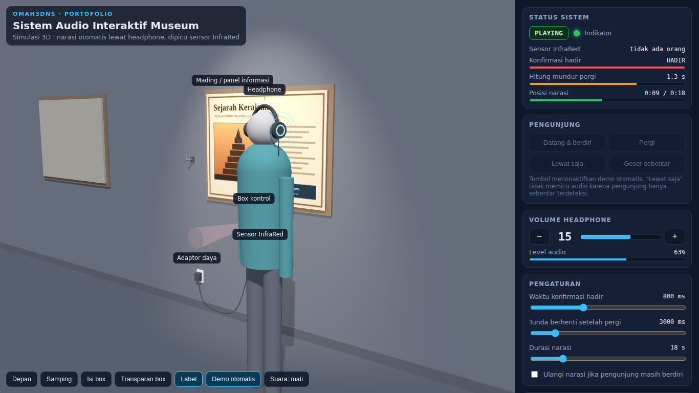

# Sistem Audio Interaktif Museum — Simulasi 3D

Simulasi 3D interaktif untuk stasiun audio museum. Pengunjung yang berdiri di depan mading terdeteksi oleh sensor InfraRed, lalu narasi sesuai topik diputar lewat headphone. Narasi berhenti otomatis setelah pengunjung pergi.

**Demo:** `https://lht-sky.github.io/museum-audio/`

Bagian dari portofolio **omah3dns**.



## Cara kerja

1. Sensor InfraRed di bawah mading mendeteksi pengunjung yang berdiri di depannya.
2. Pengunjung memakai headphone yang tergantung di samping mading.
3. Narasi diputar otomatis, dengan volume naik perlahan.
4. Orang yang hanya lewat tidak memicu narasi.
5. Setelah pengunjung pergi, narasi berhenti otomatis dan sistem siap untuk pengunjung berikutnya.
6. Volume diatur petugas dari tombol di box kontrol dan tetap tersimpan walau listrik mati.

## Fitur simulasi

- Model 3D ruang pamer: mading, box kontrol, sensor InfraRed, headphone dengan gantungan, dan kabel
- Pengunjung beranimasi dengan empat skenario: datang & berdiri, pergi, lewat saja, geser sebentar
- Mode demo otomatis yang berjalan berulang
- Status sistem, hitung mundur, posisi narasi, dan log sistem secara langsung
- Mode "Isi box" untuk melihat bagian dalam box kontrol
- Pengaturan waktu konfirmasi hadir, tunda berhenti, durasi narasi, dan mode ulang
- Suara simulasi opsional, tampilan menyesuaikan di ponsel

## Struktur folder

```
museum-audio/
├── index.html     # simulasi 3D
├── preview.png    # gambar pratinjau
└── README.md
```

## Teknologi

Three.js + OrbitControls, HTML/CSS/JavaScript tanpa build tool.

---
© omah3dns · desain & rekayasa: Lukman
